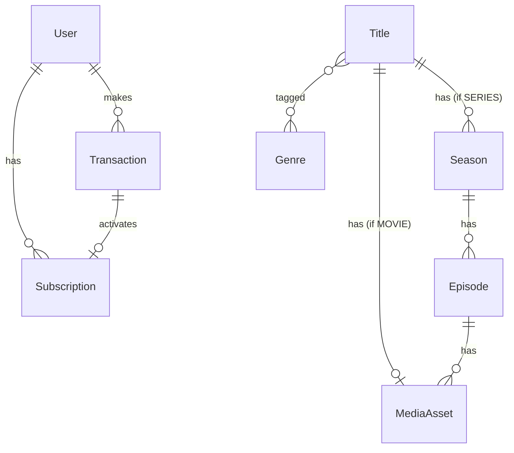

# Phase 1 Data Model: Streaming Platform MVP

Entities derived from `spec.md`'s Key Entities section, with fields, relationships, validation
rules, and state transitions needed to implement the four user stories. This is the basis for
`backend/prisma/schema.prisma`, not the schema itself.

## User

Represents an account holder — either a regular user or an admin.

| Field | Type | Notes |
|---|---|---|
| id | UUID (PK) | |
| email | string, unique | used for login |
| passwordHash | string | never exposed via API |
| role | enum: `USER`, `ADMIN` | default `USER`; only `ADMIN` may access content-management endpoints (FR-019) |
| createdAt / updatedAt | timestamps | |

**Relationships**: one User → many Subscriptions (history over time); one User → many
Transactions.

**Validation**: email must be a valid, unique address; password meets a minimum strength policy
enforced at the API boundary (not stored in plaintext).

## Subscription

A user's paid access grant for a period. In v1 there is a single plan (spec Assumptions).

| Field | Type | Notes |
|---|---|---|
| id | UUID (PK) | |
| userId | UUID (FK → User) | |
| status | enum: `ACTIVE`, `EXPIRED` | derived/maintained, not just a cached flag — see below |
| startAt | timestamp | when this period began |
| expiresAt | timestamp | `startAt` + plan period (e.g. 30 days) |
| transactionId | UUID (FK → Transaction), unique | the successful payment that activated this period |
| createdAt | timestamp | |

**Relationships**: belongs to one User; belongs to exactly one successful Transaction (FR-009).
A user may accumulate multiple Subscription rows over time (one per paid period) — "is this
user entitled right now?" is answered by: does an ACTIVE-status Subscription exist for this user
with `expiresAt` in the future.

**State transitions**: created as `ACTIVE` only when its Transaction reaches `SUCCEEDED`
(FR-009) → transitions to `EXPIRED` once `expiresAt` passes (FR-012, checked at read time and/or
by a scheduled sweep — implementation detail for `/speckit-tasks`). No other transitions in v1
(no upgrade/downgrade, no cancellation-before-expiry, per Assumptions: no refunds/proration).

## Transaction (Payment)

A record of one payment attempt, successful or not (FR-020).

| Field | Type | Notes |
|---|---|---|
| id | UUID (PK) | |
| userId | UUID (FK → User) | |
| method | enum: `MPESA`, `BANK_GATEWAY` | |
| amount | decimal | in the platform's single configured currency |
| status | enum: `PENDING`, `SUCCEEDED`, `FAILED`, `TIMED_OUT` | |
| providerReference | string, unique (nullable until provider assigns one) | used as the idempotency key for webhook/callback processing (FR-010, Principle II) |
| initiatedAt | timestamp | |
| resolvedAt | timestamp, nullable | when it left `PENDING` |
| failureReason | string, nullable | for display/audit on failure |

**Relationships**: belongs to one User; at most one Subscription references it (on success).

**Validation**: exactly one `PENDING` Transaction per user at a time (edge case in spec: prevent
a conflicting duplicate payment attempt while one is already pending).

**State transitions**: `PENDING` → `SUCCEEDED` (webhook/callback confirms payment, verified per
Principle II) | `PENDING` → `FAILED` (provider reports failure) | `PENDING` → `TIMED_OUT` (no
resolution within the provider's expected window). Terminal states do not transition further;
retrying payment creates a new Transaction.

## Title

A catalog entry — a movie or a series (FR-015).

| Field | Type | Notes |
|---|---|---|
| id | UUID (PK) | |
| type | enum: `MOVIE`, `SERIES` | |
| name | string | |
| description | string | |
| posterUrl | string | |
| genres | string[] (or join table `TitleGenre` → `Genre`) | |
| published | boolean | gates visibility in the public catalog (FR-018) |
| createdAt / updatedAt | timestamps | |

**Relationships**: if `type = MOVIE`, has exactly one MediaAsset pair (trailer + full) directly;
if `type = SERIES`, has many Seasons and no direct MediaAsset.

**Validation**: a `MOVIE` title cannot have Seasons; a `SERIES` title's playable unit is always
an Episode, never the Title itself.

## Season

Belongs to a series Title; groups Episodes.

| Field | Type | Notes |
|---|---|---|
| id | UUID (PK) | |
| titleId | UUID (FK → Title, must be `type = SERIES`) | |
| number | integer | season ordering |

## Episode

A watchable unit within a Season — structurally the same "has a trailer + full video" shape as
a movie (spec: "is itself a watchable unit like a movie").

| Field | Type | Notes |
|---|---|---|
| id | UUID (PK) | |
| seasonId | UUID (FK → Season) | |
| number | integer | episode ordering within the season |
| name | string | |
| description | string | |
| published | boolean | independent per-episode publish gate |

**Relationships**: has exactly one MediaAsset pair (trailer + full), same as a movie Title.

## MediaAsset

The actual trailer or full video file belonging to a movie Title or an Episode (FR-016).

| Field | Type | Notes |
|---|---|---|
| id | UUID (PK) | |
| ownerType | enum: `TITLE`, `EPISODE` | which kind of thing this asset belongs to |
| ownerId | UUID | FK to Title.id or Episode.id depending on `ownerType` |
| kind | enum: `TRAILER`, `FULL` | |
| processingStatus | enum: `PENDING`, `READY`, `FAILED` | (FR-017, FR-018) |
| sourceObjectKey | string | where the raw upload lives in object storage |
| hlsManifestKey | string, nullable | set once transcoding succeeds; what playback signs a URL for |
| durationSeconds | integer, nullable | |
| createdAt / updatedAt | timestamps | |

**Validation**: exactly one `TRAILER` and at most one `FULL` MediaAsset per (ownerType, ownerId).
A Title/Episode is not shown as playable (full) in the catalog until its `FULL` MediaAsset has
`processingStatus = READY` (FR-018); its trailer is likewise gated on its own `READY` state
before being offered for playback.

**State transitions**: `PENDING` (uploaded, queued for transcode) → `READY` (HLS output
produced) | `PENDING` → `FAILED` (transcode error — admin sees failure state per Edge Cases).

## Genre

Simple lookup/tag used to categorize Titles.

| Field | Type | Notes |
|---|---|---|
| id | UUID (PK) | |
| name | string, unique | |

---

## Entity Relationship Summary

